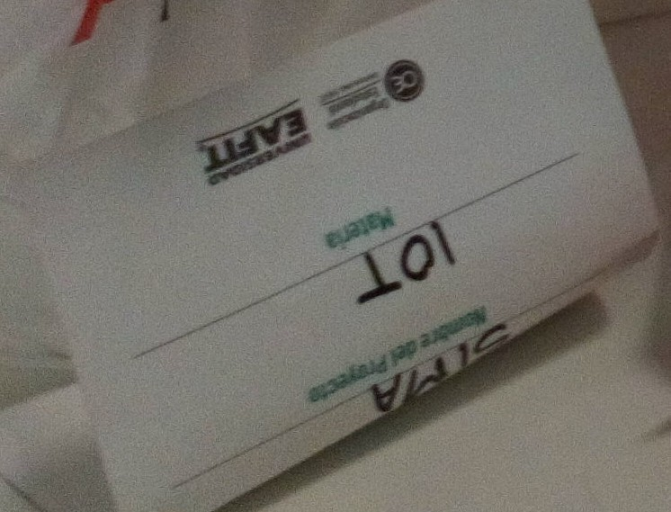
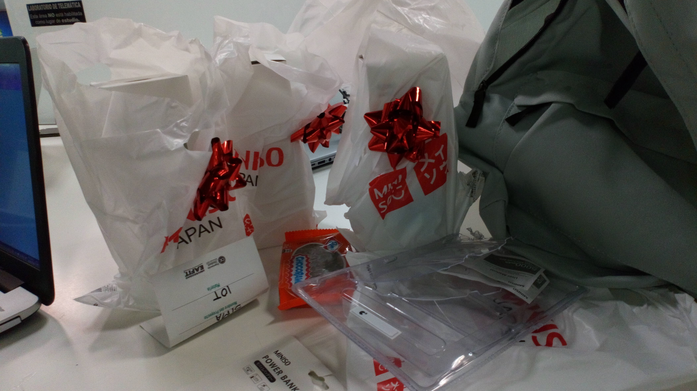

# SIMA

This is a irrigation system made for Electrónica Digital topic with the code ST0248 of the EAFIT University

## Video and More Information

This video show you how this project worked.

[video](https://youtu.be/E6DVaf4FUbo)

## Prize

We also won the third place on **Expo-Ingenierías 2019-1**  with this project.

**SIMA** stands for **S**istema de **I**rrigación y **M**onitoreo **A**utomático, that's in spanish, translated to english would be something like **I**rrigation and **A**utomatic **M**onitored **S**ystem.

**Disclaimer** I forget to take the picture when we won. 😄

    

    

## [Disclaimer]

This repository is not longer maintained
